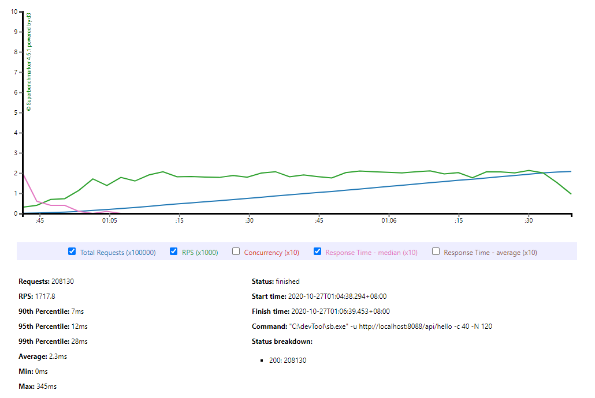
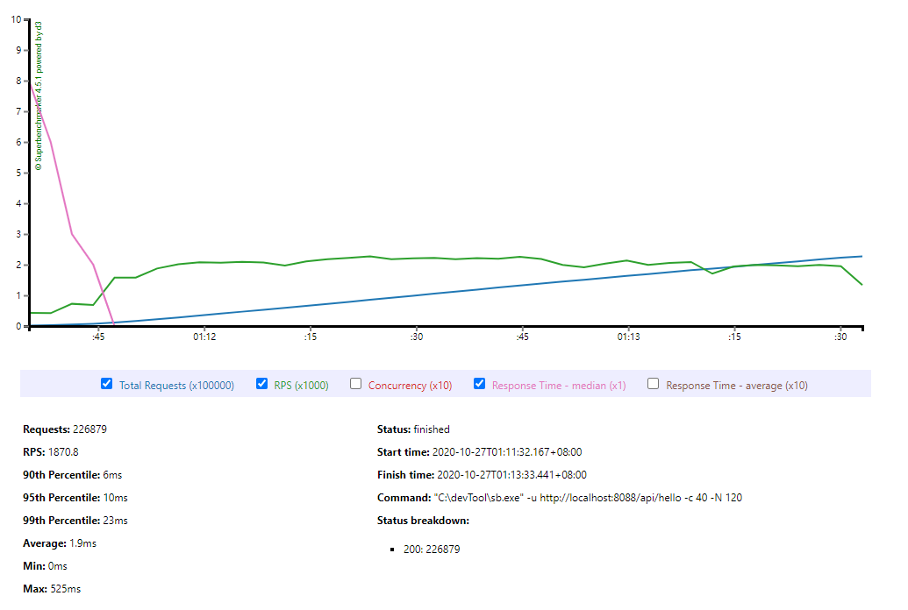
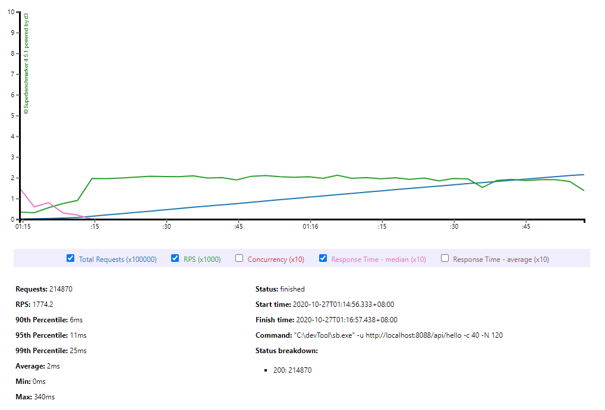

### 压力测试

#### 运行时不同的堆大小配置

> java -jar -Xms128m -Xmx128m gateway-server-0.0.1-SNAPSHOT.jar

> java -jar -Xms512m -Xmx512m gateway-server-0.0.1-SNAPSHOT.jar

> java -jar -Xms4g -Xmx4g gateway-server-0.0.1-SNAPSHOT.jar

#### 运行时不同的垃圾回收器配置

> java -jar -XX:+UseSerialGC -Xms512m -Xmx512m gateway-server-0.0.1-SNAPSHOT.jar

> java -jar -Xms512m -Xmx512m gateway-server-0.0.1-SNAPSHOT.jar

> java -jar -XX:+UseConcMarkSweepGC -Xms512m -Xmx512m gateway-server-0.0.1-SNAPSHOT.jar

> java -jar -XX:+UseG1GC -Xms512m -Xmx512m gateway-server-0.0.1-SNAPSHOT.jar

#### 压测命令

> sb -u http://localhost:8088/api/hello -c 40 -N 120

c 代表并发数，N 代表持续的时间

#### 压测结果

#### 总结

由于测试用例较为简单，换不同的垃圾回收器或者变更堆大小对于压测的影响不大。

而且压测程序需要较长时间的 warm up，到达最大 rps 值需要较长时间，普遍在一分钟以上。